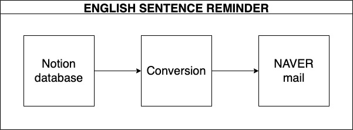

# ENGLISH SENTENCE REMINDER
### For improving my english conversation skills, I made this project which repeatedly sends what I learned before.

  
- English sentences are located in the `Notion database`
- Reminder mail is sent through `NAVER mail`

### So you can learn things below in this repository.
- How to query the information from `Notion database`
- How to send the mail throught `NAVER mail`


## Preparations
If you want to set independent environment, you can use virtual environment like virtualenv, conda and etc.

FYI, I run this project in `Python 3.9.13`

``` python
pip3 install -r requirements.txt
```

## Configurations
You have to change the name of file `config_template.py` to `config.py` for running the `main.py`.

And also you have to fill out the information in the `config.py`.